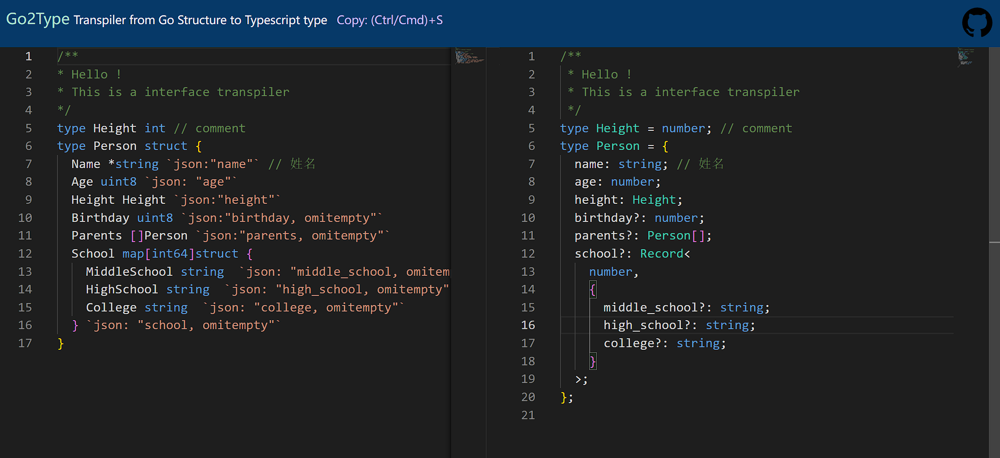

# go2type



[go2type.vercel.app](https://go2type.vercel.app/)
([backup site](https://go2type-oanakiaja.vercel.app/))

A typescript transpiler that convert golang's type to typescript's type. Help front-end developer to work faster in daily work.
My target is to provide a website tool to convert static text written in Golang interface structure to TypeScript type definition.
So the lex & parser can only parse the code about type definition, which is be designed following.

## Design
Don't support anonymous type, which is useless in interface definition.
We support common type definition in interface like 
* Single Type
* JSON Tag, (rename, omitempty)
* Inline Structure
* Comment
* map
* `*` operator

About data type, communication between frontend and backend, we just have basic type, compound structure type, and array type.

|     | TypeScript  | Golang  |
|  ----  | ----  |----  |
| Boolean  | boolean | bool |
| Number  | number | uint8/uint16/uint32/uint64/int8/int32/int64/float32/float64(don't think about complex) | 
| String | string | string |
| Array | Array<T> \| T[] | []T |
| Structure| Object | Struct {} |
| Map | Record<K,V> | Map[K]V |


### Example 
This is a golang type definition.

```go
/** 
* Hello !
* This is a interface transpiler
*/
type Height int // comment
type Person struct { 
  Name *string `json:"name"` // 姓名
  Age uint8 `json: "age"`  
  Height Height `json:"height"`  
  Birthday uint8 `json:"birthday, omitempty"` 
  Parents []Person `json:"parents, omitempty"`
  School map[int64]struct { 
    MiddleSchool string  `json: "middle_school, omitempty"`
    HighSchool string  `json: "high_school, omitempty"`
    College string  `json: "college, omitempty"`
  } `json: "school, omitempty"`
}
```
We can convert it to TypeScript definition.
```TypeScript
/**
 * Hello !
 * This is a interface transpiler
 */
type Height = number; // comment
type Person = {
  name: string; // 姓名
  age: number;
  height: Height;
  birthday?: number;
  parents?: Person[];
  school?: Record<
    number,
    {
      middle_school?: string;
      high_school?: string;
      college?: string;
    }
  >;
};
```

## TODO
- alias go > 1.8 `type A = string`
- cascade type `TypeA.TypeB`
- combination